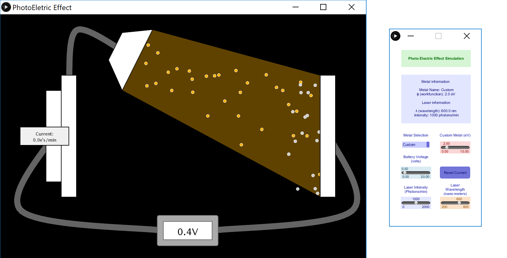
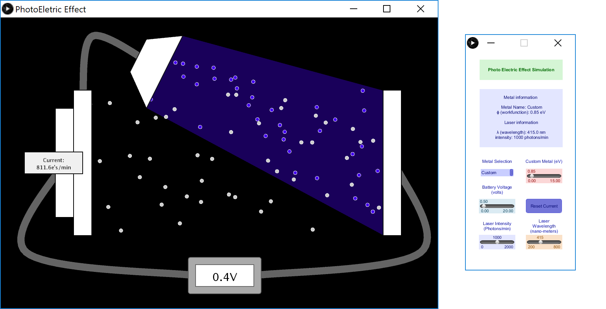

# Photoelectric-Effect

A basic simulation of the [photoelectric effect](https://en.wikipedia.org/wiki/Photoelectric_effect). There are options to adjust many factors within the experiment such as wavelength, intensity (amplitude), work function, etc. It gives a good general understading of the particle properties of light (photons).

## Requirements

* Processing (version 3 or newer)
* [G4P GUI Library](http://www.lagers.org.uk/g4p/)

## Installing

To install the G4P GUI Library
1. Open Processing
2. Navigate to Sketch
3. Import Library...
4. Add Library...
5. filter "G4P"
6. Install

After G4P is installed, simply open "Photoelectric_Effect.pde" in the "Photoelectric_Effect" folder through Processing and run.

## Instructions

The controls are very self explanatory. You have the option to adjust the following,
* Existing metal or custom metal (eV)
* Battery voltage (volts)
* Laser intensity (photons/min)
* Laser wavelength (nm)

## Screenshots

## Built With

* Processing

## Author(s)

* Bob Huang
